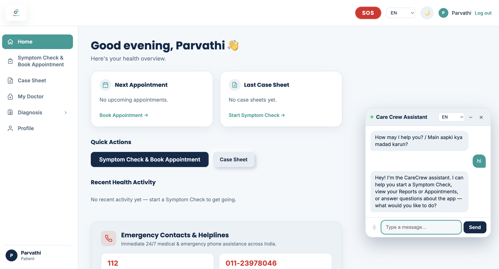
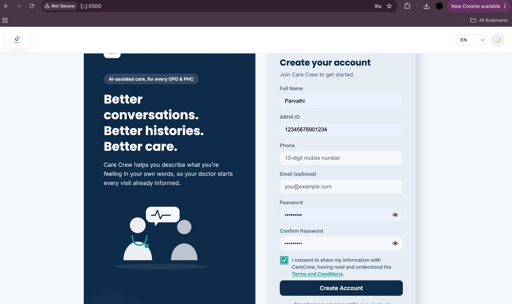
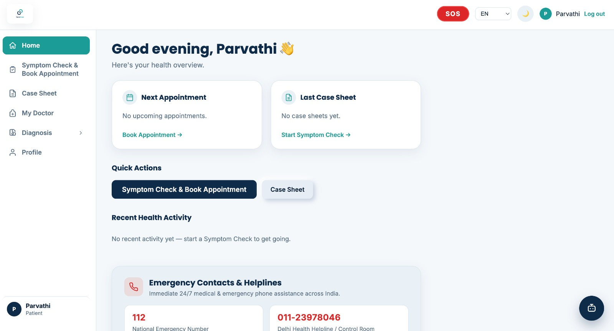
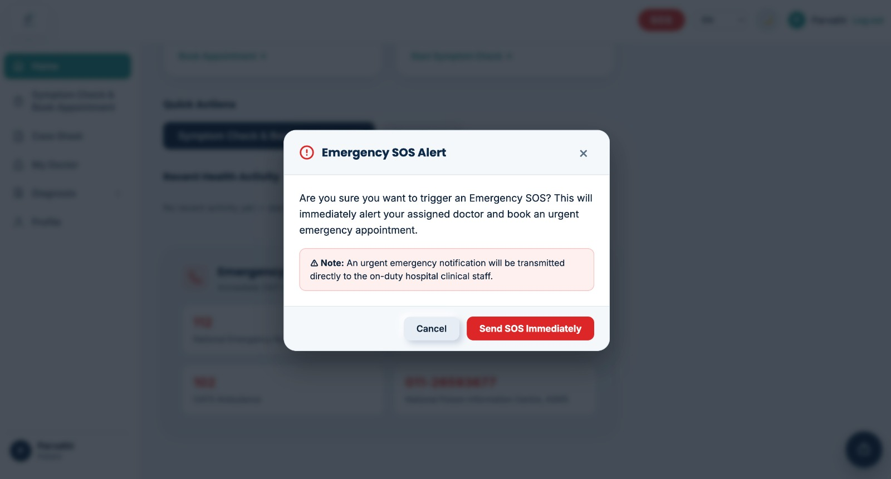
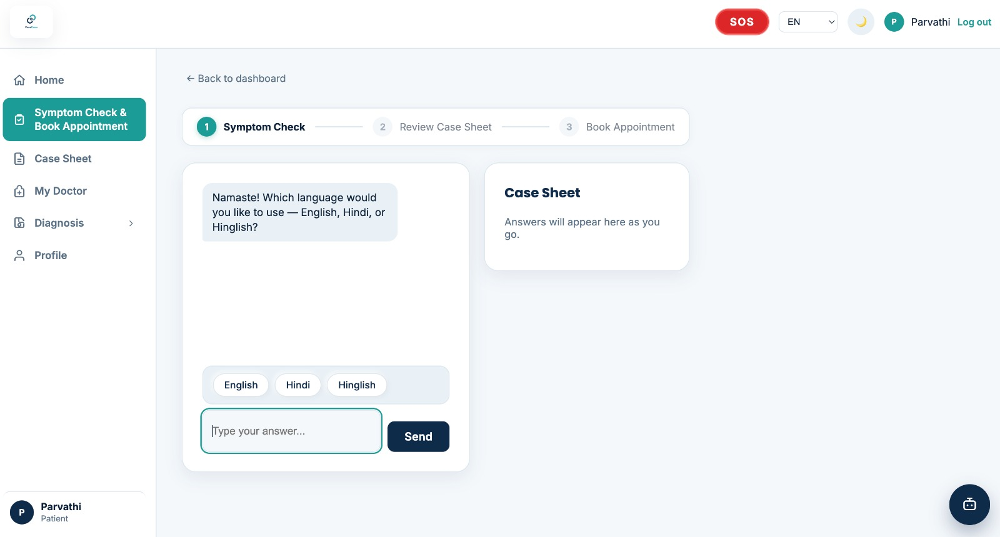
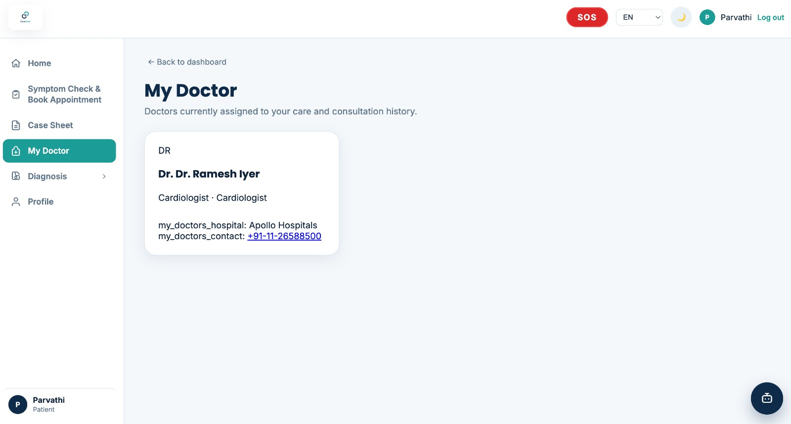
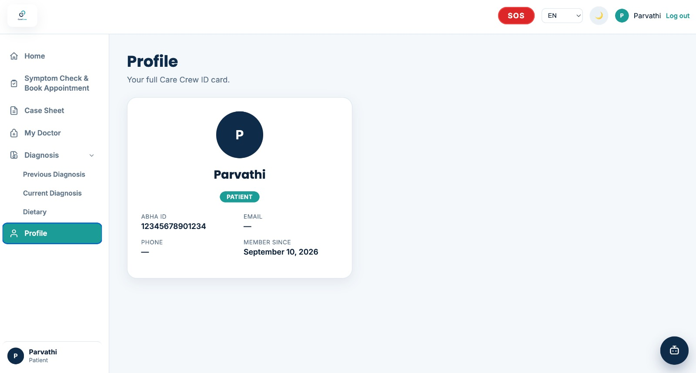

# Care-Crew Project Screenshots

This folder contains screenshots showcasing the main features and user interface of the Care-Crew healthcare application.

## Screenshots

### 1. Home Page
The landing page of the Care-Crew application.

### 2. Login Page
The login interface through which users can securely access the application.

### 3. Dashboard
The main dashboard providing users with quick access to the application's healthcare features.

### 4. SOS Emergency Feature
The SOS feature designed to provide quick access to emergency assistance.

### 5. Symptom Checker
The symptom-checking interface that helps users understand their symptoms and provides relevant guidance.

### 6. My Doctor
The My Doctor section for accessing doctor-related information and healthcare support.

### 7. User Profile
The profile section where users can view and manage their personal information.

